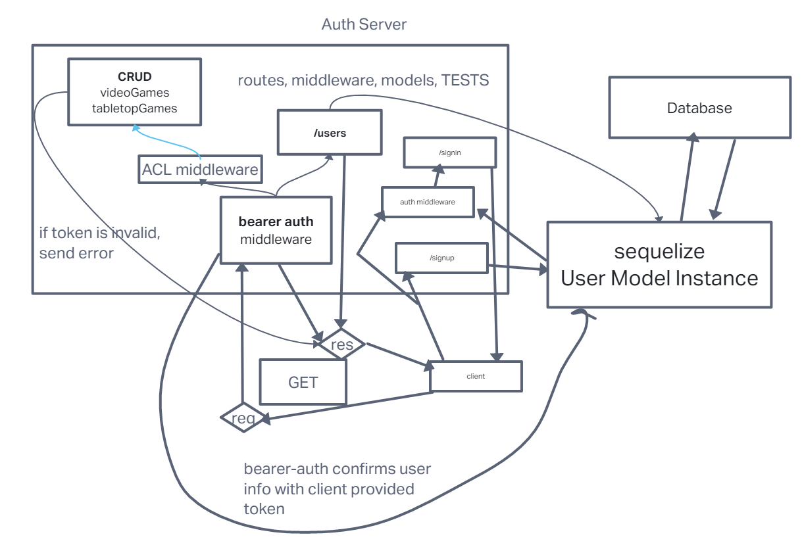

# LAB - 09

## Project: Game Master Auth API

### Authors: Tim Maupin & Ike Steoger

### Problem Domain

This is a basic server with basic authentication, both `basicAuth` and `bearerAuth`.

### Links and Resources

- [GitHub Actions ci/cd](https://github.com/IkeSteoger/gameMasterAuthAPI/actions)
<!-- - [back-end dev server url]() -->
- [back-end prod server url](https://gamemasterauthapi.onrender.com)

### Collaborators

Tim Maupin  
Ike Steoger

### Setup

#### `.env` requirements (where applicable)

See the `.env.sample`

#### How to initialize/run your application (where applicable)

Clone repo, `npm i`, set up DB with `npm run db:config` & then `npm run db:create` then run `nodemon` in the terminal

#### Routes

- GET : `/` - server is live route
- POST: `/signup` - sign up with username & password
- POST: `/signin` - sign in with username & password
- GET : `/users` - with admin priviledges you can see all registered Users
- GET : `/videoGames` - see all video games in DB, must have read access
- GET : `/videoGames/:id` - see a video game by ID in DB, must have read access
- POST : `/videoGames` - add to video games in DB, must have writer access
- PUT : `/videoGames/:id` - update a video game by ID, must have editor access
- DELETE : `/videoGames/:id` - delete a video game by ID, must have admin access
- GET : `/tabletopGames` - see all video games in DB, must have read access
- GET : `/tabletopGames/:id` - see a video game by ID in DB, must have read access
- POST : `/tabletopGames` - add to video games in DB, must have writer access
- PUT : `/tabletopGames/:id` - update a video game by ID, must have editor access
- DELETE : `/tabletopGames/:id` - delete a video game by ID, must have admin access

#### Tests

To run tests, after running `npm i`, run the command `npm test`

#### UML

